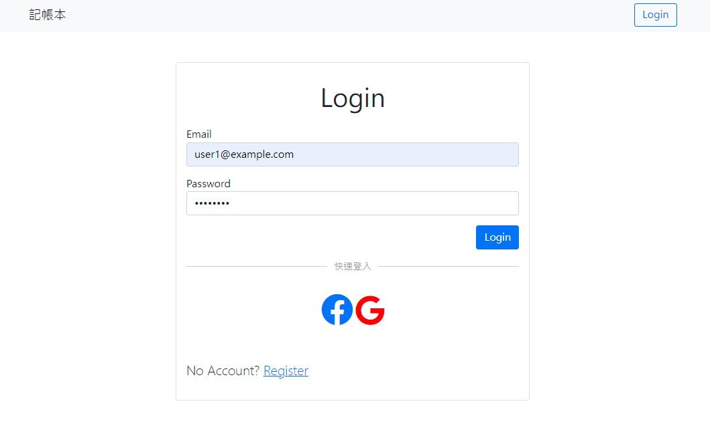
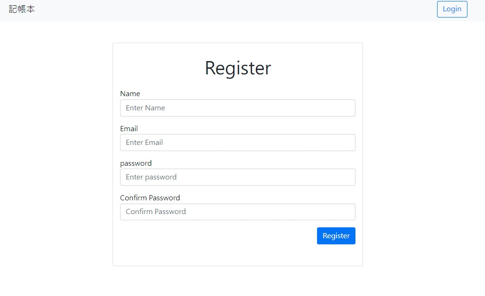
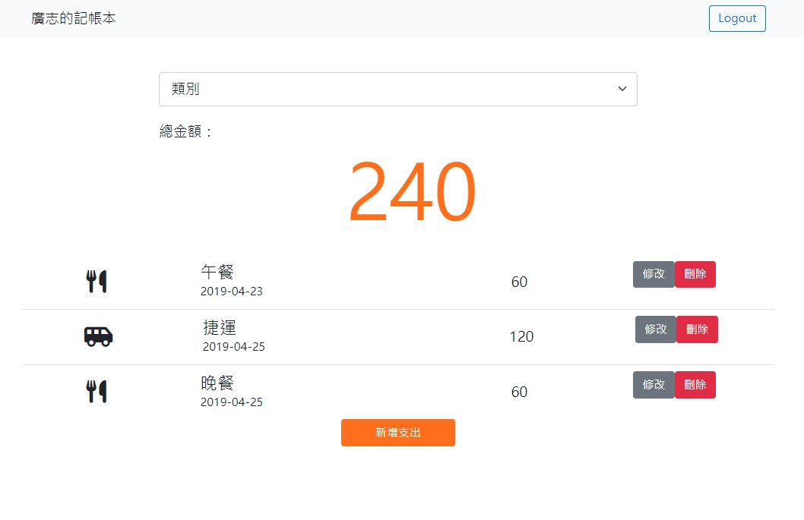

# expense-tracker
### 登入畫面



### 註冊畫面



### 使用者畫面



## 基本功能
- Email & 密碼一般登入
- Google & Facebook 登入
- 新增、編輯、刪除每筆花費，並依照類別篩選花費

## 環境設置

1.安裝 node.js 與 npm

2.將專案 clone 到本地

```
https://github.com/happygod119/expense-tracker.git
```

3. 安裝 npm 套件

```
npm install
```

4. 執行程式

```
npm run start
```

5.若出現此行網址代表運行順利

```
http://localhost:3000
```

## 開發工具

- Node.js v14.16.0
- bcryptjs ^2.4.3
- body-parser ^1.20.0
- connect-flash ^0.1.1
- dotenv ^16.0.0
- express": ^4.17.3
- express-handlebars ^6.0.4
- express-session ^1.17.2
- method-override ^3.0.0
- mongoose ^6.2.10
- passport ^0.5.2
- passport-facebook ^3.0.0
- passport-google-oauth20 ^2.0.0
- passport-local ^1.0.0
